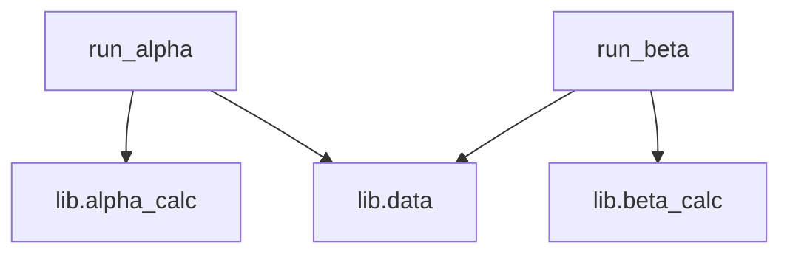

# System Architecture Map

> This file is maintained by the Lead Architect (Planner).
> The **Index Skeleton** section below is **auto-generated from repo facts**.
> Do not delete it; refine/correct it as you discover details.

## Index Skeleton (auto-generated)

### Entrypoints
- run_alpha.py `python run_alpha.py` (python_main)
- run_beta.py `python run_beta.py` (python_main)

### Core modules (graph-central)
- `lib.alpha_calc`
- `lib.beta_calc`
- `lib.data`
- `run_alpha`
- `run_beta`

### Module dependency sketch (from `repo_index_summary`)

## Architectural Reasoning (to be refined)

- Inputs: (TBD — derive from CLI/API boundaries once inspected)
- Outputs: (TBD — metrics/artifacts/files/network)
- Critical path: (TBD — trace end-to-end execution from entrypoint)

--- Architectural Update (2026-02-01 17:30:32) ---
## Architectural Reasoning

- **Inputs**: The inputs are derived from the command-line execution of `run_alpha.py` and `run_beta.py`, which likely process data using the shared library functions.
- **Outputs**: The outputs are the computed metrics stored in `artifacts/metrics.json`.
- **Critical Path**: The critical path involves executing `run_alpha.py` and `run_beta.py`, which utilize `lib.alpha_calc` and `lib.beta_calc` respectively, to compute and output the required metrics.